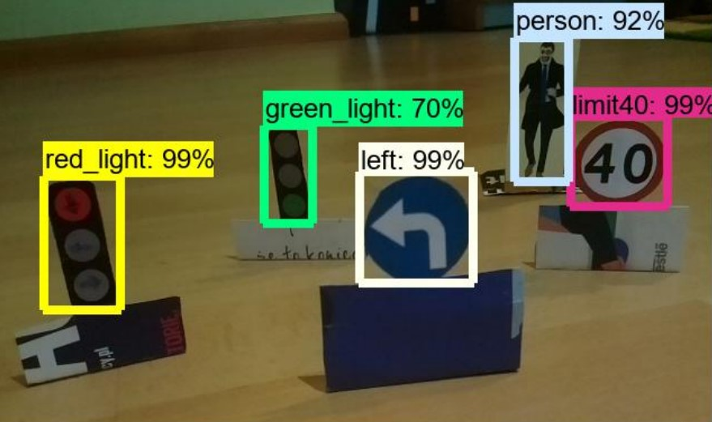

# SelfDrivingCar
This project consist of two application:
1) Client application for raspberry pi.
2) Server application which can run for instance on personal computer.

## Client application
This application run on raspberry pi, and it grab data from sensors, and frames from camera. This application 
communicate with server and send data 
to server. As a response, server send action (run, stop, turn right etc) that should be taken by car.

## Server application
Application receive images and sensors data from client. Then it use pretrained model to detect objects (such as road signs, traffic lights, cars or person).
Based on detected objects and sensors data, application determines action, and send it back to client.

## Robot

## Objects detected from image

